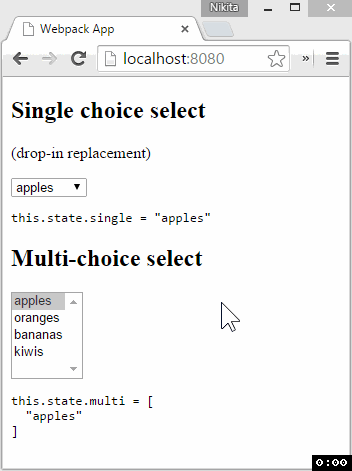

# react-normalized-select [](https://www.npmjs.com/package/react-normalized-select)

Normalized `<select>`, returns array of values in multiple mode

[](https://gitter.im/nkbt/help)
[](https://david-dm.org/nkbt/react-normalized-select)
[](https://david-dm.org/nkbt/react-normalized-select#info=devDependencies)



## Reason

When using common `<select>` element it returns only single value in onChange event. So to get the array of selected values it is necessary to traverse through it's options to find selected ones. This component normalizes behaviour of `<select>` so it returns array of values if `multiple={true}` flag is present.

Component is a pure wrapper, has no extra logic and supposed to be a drop-in replacement for a conventional `<select>`

This normalization is necessary to work in composition with other form elements wrappers without breaking `onChange` API.


## Installation


### NPM

```sh
npm install --save react react-normalized-select
```

Don't forget to manually install peer dependencies (`react`) if you use npm@3.


### 1998 Script Tag:

```html
<script src="https://unpkg.com/react/dist/react.js"></script>
<script src="https://unpkg.com/react-normalized-select/build/react-normalized-select.js"></script>
(Module exposed as `NormalizedSelect`)
```


## Demo

[http://nkbt.github.io/react-normalized-select](http://nkbt.github.io/react-normalized-select)

## Codepen demo

```js
// TODO
```

## Usage

#### 1. Drop-in replacement

All functionality is the same as for `<select>`.

```js
import Select from 'react-normalized-select';

// ...
<Select className="mySelect" onChange={e => console.log(e.target.value)}>
  {['apples', 'oranges', 'bananas'].map(option =>
    <option key={option} value={option}>{option}</option>)}
</Select>
```

Will render conventional `<select>` and by choosing `apples` we will get `apples` in a console

#### 2. Multi-select mode

Will return array of selected values instead of single string value.

```js
import Select from 'react-normalized-select';

// ...
<Select className="mySelect" multiple={true} onChange={e => console.log(e.target.value)}>
  {['apples', 'oranges', 'bananas'].map(option =>
    <option key={option} value={option}>{option}</option>)}
</Select>
```

Will render conventional `<select>` but when we choose apples **and** bananas, we will get `[apples, bananas]` in a console

## Example

```js
import React from 'react';
import ReactDOM from 'react-dom';
import Select from 'react-normalized-select';

const App = React.createClass({
  getInitialState() {
    return {
      single: 'apples',
      multi: ['apples']
    };
  },

  renderOptions() {
    return ['apples', 'oranges', 'bananas', 'kiwis']
      .map(option => <option key={option} value={option}>{option}</option>);
  },

  render() {
    return (
      <div>
        <div>
          <h2>Single choice select</h2>
          <p>(drop-in replacement)</p>
          <label>
            <Select
              value={this.state.single}
              onChange={e => this.setState({single: e.target.value})}>
              {this.renderOptions()}
            </Select>
          </label>

          <pre>this.state.single = {JSON.stringify(this.state.single, null, '  ')}</pre>
        </div>

        <div>
          <h2>Multi-choice select</h2>
          <label>
            <Select multiple={true}
              size={5}
              value={this.state.multi}
              onChange={e => this.setState({multi: e.target.value})}>
              {this.renderOptions()}
            </Select>
          </label>

          <pre>this.state.multi = {JSON.stringify(this.state.multi, null, '  ')}</pre>
        </div>
      </div>
    );
  }
});


const appRoot = document.createElement('div');
document.body.appendChild(appRoot);
ReactDOM.render(<App />, appRoot);
```


## License

MIT
