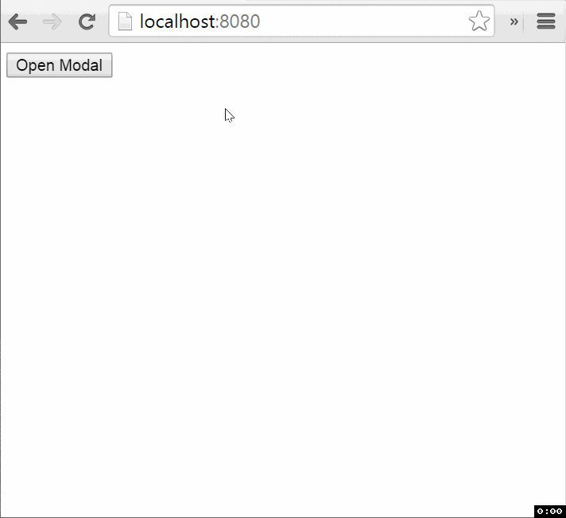

# react-page-click [](https://www.npmjs.com/package/react-page-click)

React component-wrapper to detect page events (mousedown or touchstart/touchend) outside of wrapped element.

[](https://gitter.im/nkbt/help)
[](https://david-dm.org/nkbt/react-page-click)
[](https://david-dm.org/nkbt/react-page-click#info=devDependencies)





## Installation


### NPM

```sh
npm install --save react react-page-click
```

Don't forget to manually install peer dependencies (`react`) if you use npm@3.


### 1998 Script Tag:

```html
<script src="https://unpkg.com/react/dist/react.js"></script>
<script src="https://unpkg.com/react-page-click/build/react-page-click.js"></script>
(Module exposed as `ReactPageClick`)
```


## Demo

[http://nkbt.github.io/react-page-click](http://nkbt.github.io/react-page-click)

## Codepen demo

[http://codepen.io/nkbt/pen/JYEPVQ](http://codepen.io/nkbt/pen/JYEPVQ?editors=101)

## Usage

Show only when `this.state.opened` and hide by click anywhere on a page outside of `.popup` element.

```jsx
{this.state.opened ? (
  <ReactPageClick notify={() => this.setState({opened: false})}>
    <div className="popup">
      Some Popup content
    </div>
  </ReactPageClick>
) : null}
```


## Modal window example

```jsx
import React from 'react';
import ReactDOM from 'react-dom';
import {ReactPageClick} from 'react-page-click';


const styles = {
  popup: {
    position: 'fixed',
    top: '50%',
    left: '50%',
    width: '40%',
    height: '40%',
    marginTop: '-20%',
    marginLeft: '-20%',

    fontSize: 30,
    textAlign: 'center',

    background: 'rgba(255, 255, 255, 0.9)',
    borderRadius: 10
  },
  shade: {
    position: 'fixed',
    top: 0,
    left: 0,
    right: 0,
    bottom: 0,
    background: 'rgba(0, 0, 0, 0.3)'
  },
  content: {
    padding: 50
  }
};

const Modal = React.createClass({
  propTypes: {
    onClose: React.PropTypes.func.isRequired
  },

  render() {
    const {onClose, ...props} = this.props;

    return (
      <div>
        <div style={styles.shade} />
        <ReactPageClick notify={this.props.onClose}>
          <div style={styles.popup}>
            <div style={styles.content} {...props} />
          </div>
        </ReactPageClick>
      </div>
    );
  }
});


const App = React.createClass({
  getInitialState() {
    return {
      showModal: false
    };
  },


  render() {
    const {showModal} = this.state;

    return (
      <div>
        <button onClick={() => this.setState({showModal: true})}>
          Open Modal
        </button>

        {showModal ? (
          <Modal onClose={() => this.setState({showModal: false})}>
            Modal content
          </Modal>
        ) : null}
      </div>
    );
  }
});


const appRoot = document.createElement('div');
document.body.appendChild(appRoot);
ReactDOM.render(<App />, appRoot);
```

## Options


#### `notify`: PropTypes.func.isRequired

Function called when mousedown or touchstart/touchend is detected


#### `notifyOnTouchEnd`: PropTypes.bool (default: false)

Should `notify` be called when on touchstart or touchend on a touch device. This can be useful when
you only want to call `notify` when the user taps, instead of scrolling or zooming.

Default value is `false` which means that `notify` will get triggered on mousedown or touchstart.


#### `outsideOnly`: PropTypes.bool (default: true)

Should `notify` be called when mousedown or touchstart/touchend is detected outside of wrapped
element or anywhere including it?

Default value is `true` which means that events will be detected only outside of wrapped element.


#### `children`: PropTypes.node.isRequired

The only child element is required. It must be a valid DOM element, otherwise it is not possible to
capture events on it.


## License

MIT
