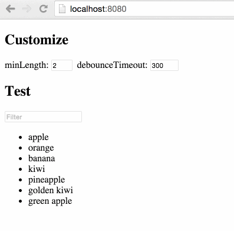

# react-text-filter [](https://www.npmjs.com/package/react-text-filter)

React component that renders filtering Input

[](https://gitter.im/nkbt/help)
[](https://david-dm.org/nkbt/react-text-filter)
[](https://david-dm.org/nkbt/react-text-filter#info=devDependencies)





## Installation


### NPM

```sh
npm install --save react react-text-filter
```

Don't forget to manually install peer dependencies (`react`) if you use npm@3.


### 1998 Script Tag:

```html
<script src="https://unpkg.com/react/dist/react.js"></script>
<script src="https://unpkg.com/react-text-filter/build/react-text-filter.js"></script>
(Module exposed as `TextFilter`)
```


## Demo

[http://nkbt.github.io/react-text-filter](http://nkbt.github.io/react-text-filter)

## Codepen demo

[http://codepen.io/nkbt/pen/ZGmpoO](http://codepen.io/nkbt/pen/ZGmpoO?editors=101)

## Usage
```js
import React, {PropTypes} from 'react';
import ReactDOM from 'react-dom';
import {TextFilter} from 'react-text-filter';


const Item = React.createClass({
  propTypes: {
    item: PropTypes.string.isRequired
  },


  render() {
    return <li>{this.props.item}</li>;
  }
});


const List = React.createClass({
  propTypes: {
    items: PropTypes.arrayOf(PropTypes.string).isRequired
  },


  render() {
    const Items = this.props.items.map(item => <Item key={item} item={item} />);

    return <ul>{Items}</ul>;
  }
});


const fruits = [
  'apple',
  'orange',
  'banana',
  'kiwi',
  'pineapple',
  'golden kiwi',
  'green apple'
];


const fruitFilter = filter => fruit => fruit.toLowerCase().indexOf(filter.toLowerCase()) !== -1;


const App = React.createClass({
  getInitialState() {
    return {filter: ''};
  },


  render() {
    const filteredFruits = this.state.filter ?
      fruits.filter(fruitFilter(this.state.filter)) :
      fruits.slice(0);

    return (
      <div>
        <TextFilter onFilter={({target: {value: filter}}) => this.setState({filter})} />
        <List items={filteredFruits} />
      </div>
    );
  }
});

const appRoot = document.createElement('div');
document.body.appendChild(appRoot);
ReactDOM.render(<App />, appRoot);
```

## Options


#### `onFilter`: PropTypes.func.isRequired

Function called when filter is changed (debounced) with original event passed through


#### `filter`: PropTypes.string (default: '')

Initial filter value


#### `minLength`: PropTypes.number (default: 2)

Minimal length of text to start notify


#### `debounceTimeout`: PropTypes.number (default: 300)

Notification debounce timeout in ms


#### Arbitrary props will be transferred to the rendered `<input>`

```js
<TextFilter
  onFilter={({target: {value: filter}}) => this.setState({filter})}
  placeholder="Filter"
  className="my-filter" />
```

Will result in

```js
<input type="text"
  placeholder="Filter"
  className="my-filter" />
```

## License

MIT
